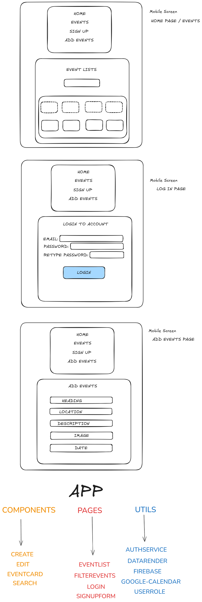

<h2>ADMIN ROLE</h2>
email: admin_event_management@admin.com 
password: admin@EVENTS2025
<h2>SET-UP.</h2>
created a new directory in the terminal entitled 'Event-Management' and then proceeded to cd into same directory.
npm create vite@latest events-platform -- --template react
  
<h2>PLAYWRIGHT.</h2>
installed playwright testing: 
npm init playwright 
 
changed the package.json file: 
"scripts": { 
    "test": "playwright test --headed" 
} 
Completed test(s) for the following: 
(1) Title of website. 
(2) Navigation Links. 
(3) Log In Authentication. 
(4) Create Event. 
(5) Edit Event. 
(6) Form Validation. 
(7) Sign Up Button. 
(8) Registed the Site with Google reCAPTCHA. 
(9) npm install react-google-recaptcha.  
(10) Updated the Login_Events.jsx.  
(11) I added google-site-verification from the Google Search Console.  
(12) Updated the headings tags, recognized landmark to pass accessibility testing.  
(13) The platform should clearly communicate errors to the users. 👉 no fallback route for not found errors.  
(14) Created a NotFound.jsx fallback route.  
(15) 

<h2>FIREBASE.</h2>
npm install firebase 
npm install -g firebase-tools 
npm firebase deploy 
npm install firebase react-router-dom 
Created a user called admin@events.com to login and create/edit.

<h2>Project Structure.</h2>
src/ 
├── Components/ 
│ ├── CreateEvent.jsx 
│ ├── EditEvent.jsx 
│ └── EventCard.jsx 
│ └── Nav.jsx 
│ └── SearchEvents.jsx 
├── Pages/ 
│ ├── EventList.jsx 
| ├── FilterEvents.jsx 
│ ├── Login.jsx 
│ └── SignupForm.jsx 
├── Utils/ 
│ ├── authService.js 
| └── DataRender.jsx 
│ └── EventDatabase.jsx 
│ └── firebase.js 
│ └── googlecalendar.js 
│ └── userRole.js 
├── App.jsx 
└── main.jsx 

<h2>Google Calendar API</h2>
On the Google Calendar website >> Create project > Enable Google Calendar API >> OAuth consent screen > Add scope >> https://www.googleapis.com/auth/calendar.events >> Create OAuth Client ID → Web App >> http://localhost:5173
  
I added the script tag to the following path public/index.html  
Added the Google Calendar API information to services/calendar.js

<h2>LIGHTHOUSE</h2>
npm install -D vite-imagetools 
added the line(s) link rel="preconnect" 

<h2>WrireFrames</h2>

