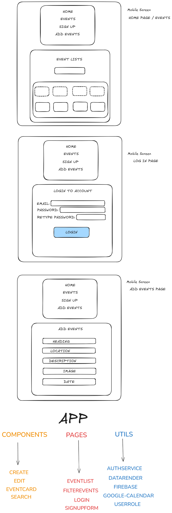

<h1>SET-UP.</h1>
npm create vite@latest events-platform -- --template react
  
<h2>PLAYWRIGHT.</h2>
installed playwright testing: 
npm init playwright 
 
changed the package.json file: 
"scripts": { 
    "test": "playwright test --headed" 
} 
Completed test(s) for the following: 
(1) Title of website. 
(2) Navigation Links. 
(3) Log In Authentication. 
(4) Create Event. 
(5) Edit Event. 

<h2>FIREBASE.</h2>
npm install firebase 
npm install -g firebase-tools 
npm firebase deploy 
npm install firebase react-router-dom 
  
<h2>Project Structure.</h2>
src/ 
├── Components/ 
│ ├── CreateEvent.jsx 
│ ├── EditEvent.jsx 
│ └── EventCard.jsx 
│ └── Nav.jsx 
│ └── SearchEvents.jsx 
├── Pages/ 
│ ├── EventList.jsx 
│ ├── Login.jsx 
│ ├── FilterEvents.jsx 
│ └── Login.jsx 
├── Utils/ 
│ ├── DataRender.js 
│ └── EventDatabase.jsx 
│ └── firebase.js 
│ └── googlecalendar.js 
│ └── userRole.js 
├── App.jsx 
└── main.jsx 
  
On the Google Calendar website >> Create project > Enable Google Calendar API >> OAuth consent screen > Add scope >> https://www.googleapis.com/auth/calendar.events >> Create OAuth Client ID → Web App >> http://localhost:5173
  
I added the script tag to the following path public/index.html  
Added the Google Calendar API information to services/calendar.js

